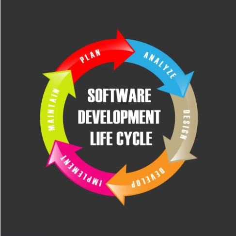

# Lesson 1 : Roadmap to IT Project Management

#### Table of Contents
- [Lesson 1 : Roadmap to IT Project Management](#lesson-1--roadmap-to-technical-project-management)
      - [Table of Contents](#table-of-contents)
  - [1. What is Agile?](#1-what-is-agile)
    - [Agile Video (Youtube)](#play_or_pause_buttonclick-image-below-to-watch-video-1)
  - [2. Understanding Your New Role in Project Management](#2-understanding-your-new-role-in-project-management)
    - [IT Project Management (Youtube) ](#play_or_pause_button-video-2)
  - [Adjacent Roles](#adjacent-roles)
  - [3. The Role of a IT Project Manager](#3-the-role-of-a-it-project-manager)
  - [4. Day-to-Day Responsibilities](#4-day-to-day-responsibilities)
  - [5. Recommended Resources](#5-recommended-resources)

## 1. What is Agile?

### **An Agile Roadtrip**:car::cloud:
Imagine you're on a road trip with your friends, and you want to reach your destination as quickly and efficiently as possible. Instead of meticulously planning every single detail of the trip from start to finish, Agile suggests a different approach.

Agile is like having a GPS navigation system for your road trip. You have a general idea of where you want to go, but you're also open to making adjustments and taking detours along the way. You constantly adapt to changing road conditions, traffic, and even the preferences of your fellow travelers.

In an Agile mindset, you break down your journey into small, manageable chunks. You set short-term goals or milestones, like reaching the next city or landmark, rather than planning the entire trip upfront. You regularly assess your progress, get feedback from your friends, and make course corrections as needed.

#### :play_or_pause_button:**Click below to watch Video #1**

## 2. Understanding Your New Role in Project Management

IT Project Management goes beyond Agile frameworks and encompasses a broader scope of project management in the tech industry. Explore the principles and practices of managing technology projects, including planning, executing, and controlling projects to deliver successful outcomes.

#### :play_or_pause_button: Video #2

## 3. The Role of a IT Project Manager

As a IT Project Manager, you will be responsible for overseeing the entire project lifecycle. Understand the key responsibilities, such as stakeholder management, resource allocation, risk identification and mitigation, and ensuring timely delivery. Gain insights into the importance of effective communication and collaboration with team members, stakeholders, and clients.

#### Adjacent Roles:
- **Iteration Manager:** An Iteration Manager, also known as an Agile Project Manager or Delivery Manager, focuses on managing the iteration or sprint cycle. They facilitate the planning, coordination, and execution of iterations, ensuring that teams are aligned, tasks are on track, and impediments are addressed.

- **Kanban Lead:** A Kanban Lead oversees the implementation and maintenance of Kanban systems within teams or organizations. They work closely with teams to establish visual workflows, set work-in-progress limits, and continuously improve the flow of work.

- **Product Owner:** While the Product Owner has distinct responsibilities, there are some overlaps with the Scrum Lead role. Product Owners are responsible for defining and prioritizing the product backlog, collaborating with stakeholders, and ensuring the team delivers value to the customers.

- **Release Manager:** A Release Manager coordinates the planning and execution of software releases. They work closely with the development team, stakeholders, and other teams involved in the release process to ensure smooth and timely releases.

- **DevOps Engineer:** A DevOps Engineer focuses on the collaboration and integration of development and operations teams. They help streamline the software delivery pipeline, automate processes, and ensure smooth deployment and operations.

- **Project Manager:** While traditional project management and Agile project management have distinct approaches, some organizations blend the two. In such cases, the Project Manager takes on the responsibility of managing the overall project, including coordinating activities, managing resources, and ensuring successful delivery.
 </ul>

## 4. Day-to-Day Responsibilities

Explore the day-to-day aspects of being a IT Project Manager. Learn about project planning and tracking, setting milestones, managing project scope, monitoring progress, and making necessary adjustments to keep projects on track. Understand how to lead and motivate your team, facilitate effective communication, and ensure that all project deliverables meet quality standards.

## 5. Recommended Resources

To further enhance your transition to tech as a IT Project Manager, consider the following resources:

- **Books**:
  - "The Lean Startup: How Today's Entrepreneurs Use Continuous Innovation to Create Radically Successful Businesses" by Eric Ries
  - "Project Management for the Unofficial Project Manager" by Kory Kogon, Suzette Blakemore, and James Wood

- **Online Courses**:
  - [Project Management Professional (PMP) Certification](https://www.pmi.org/certifications/project-management-pmp) by the Project Management Institute (PMI)
  - [Agile Project Management](https://www.udemy.com/topic/agile/) on Udemy

- **Blogs and Websites**:
  - [ProjectManagement.com](https://www.projectmanagement.com/) - Online community and resource hub for project managers
  - [AgileAlliance.org](https://www.agilealliance.org/resources)- Global nonprofit org. These resources will provide you with valuable insights into the day-to-day aspects of project managerment. 
  - [Atlassian Agile Coach](https://www.atlassian.com/agile)- An Agile Coach website from the company behind **Jira** and **Trello**
  - [Trello Agile Guide](https://blog.trello.com/beginners-guide-scrum-and-agile-project-management)- This interactive guide offers tips on sprint planning, creating task boards, tracking progress, and conducting sprint reviews
