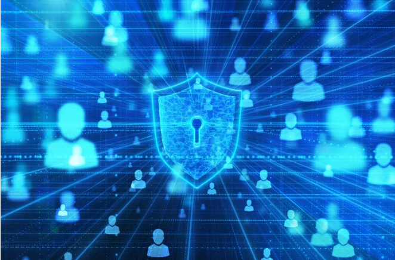

# Career Roadmap for Jude :bulb:

#### 1. **Obtain Recognized Certifications for Entry-Level Cybersecurity Professionals:**

   - [CompTIA Security+ (Free Study Materials)](https://www.linkedin.com/learning/topics/comptia?src=go-pa&trk=sem-ga_campid.11272822688_asid.110000966305_crid.470642844125_kw.comptia%20courses_d.c_tid.kwd-185271972_n.g_mt.p_geo.9028724&mcid=6841886150127296638&cid=&gclid=CjwKCAjw04yjBhApEiwAJcvNoYq9OAD2WiB4h4E1f-hx2gsP4Zlbjnhocwg0Mga76FU-faqi_wqQJRoCZD4QAvD_BwE&gclsrc=aw.ds)
   - [Cybrary Certified Professional (CCP)](https://www.cybrary.it/certifications)
   - [Google IT Support Professional Certificate (Coursera)](https://grow.google/certificates/it-support/?utm_source=google&utm_medium=paidsearch&utm_campaign=ha-sem-bk-it-exa__geo--US&utm_term=google%20it%20support%20professional%20certificate&gad=1&gclid=CjwKCAjw04yjBhApEiwAJcvNoaarFQQF7CPf3XTYsSPL4w-BnrzIjBDDvw0VZcm20YnhIqjyiG_d_xoCurwQAvD_BwE#?modal_active=none)
   

#### 2. **Pursue Internships or Project Opportunities Leading to Entry-Level Cybersecurity Jobs.**

  - [LinkedIn](https://www.linkedin.com/jobs) - Utilize LinkedIn's professional network and job board to search for openings, follow companies, and connect with industry professionals.

  - [Indeed](https://www.indeed.com) - Explore one of the largest job search platforms, featuring a wide range of opportunities across industries.

  - [Glassdoor](https://www.glassdoor.com) - Access job listings, company reviews, salary information, and interview insights for a comprehensive view of potential employers.

 - [CareerBuilder](https://www.careerbuilder.com) - Find a variety of job opportunities, including entry-level positions suitable for early career professionals.

 - [Internships.com](https://www.internships.com) - Focuses on internships but also lists entry-level jobs suitable for recent graduates and students.

#### 3. **Continuous Learning Through Online Courses, Workshops, Conferences, and Industry Publications.**

 - [Cybrary](https://www.cybrary.it) - Offers a range of free and affordable cybersecurity courses, covering topics like network security, ethical hacking, and incident response.

 -  [Udemy](https://www.udemy.com) - An online learning platform with affordable cybersecurity courses. Look for courses taught by experienced instructors with high ratings and reviews.

 - [Coursera](https://www.coursera.org) - Partners with top universities and institutions to provide online cybersecurity courses. Some may require a fee, but financial aid is often available for eligible students.

 - [LinkedIn Learning](https://www.linkedin.com/learning) - Provides a vast library of cybersecurity courses, including hands-on training and guidance from industry experts. Offers a free trial period and is often accessible through a LinkedIn Premium subscription.

 - [Pluralsight](https://www.pluralsight.com) - Offers a subscription-based model with a free trial period. Provides a wide range of cybersecurity courses for self-paced learning.

- [The Top Technology Publications And Blogs To Read](https://www.relevance.com/tech-publications/):bulb:

_**Remember to read course descriptions, reviews, and ratings before enrolling in any online course. Seek courses aligned with the specific tech certifications you target for your entry-level cybersecurity job. Additionally, watch for discounts or promotions on these platforms to make courses more affordable._**

 

#### 4.**Participate in Cybersecurity Conferences, Join Professional Organizations, and Network with Industry Experts for Professional Growth.**
 

-  **Cybersecurity Meetups and Communities**:
   - [Meetup](https://www.meetup.com) - Search for local cybersecurity meetups in your area to connect with like-minded professionals and access events, workshops, and networking opportunities.
   - [Reddit](https://www.reddit.com/r/cybersecurity) - Join cybersecurity-related subreddits to engage in discussions, ask questions, and connect with industry experts. Look for local subreddits or those specific to your areas of interest.

- **Virtual Conferences and Webinars**:
   - [Black Hat](https://www.blackhat.com) - A well-known cybersecurity conference focusing on the latest industry trends, research, and techniques. Offers virtual events, webinars, and training sessions for remote participation.
   - [Defcon](https://www.defcon.org) - Another popular cybersecurity conference covering a wide range of topics. Provides virtual sessions and workshops accessible from anywhere.

- **Online Communities and Forums**:
   - [Cybrary Community](https://www.cybrary.it/community) - An active community forum for connecting with cybersecurity enthusiasts, asking questions, and sharing knowledge.
   - [Hack The Box](https://www.hackthebox.eu) - An online platform offering hands-on cybersecurity challenges and training. Features an active community for engagement and learning from experienced professionals.

Remember to regularly check websites and platforms for updates on upcoming events, conferences, and networking opportunities. Additionally, consider reaching out to local universities or cybersecurity organizations to inquire about youth-focused events or programs they may offer.

 

#### 5. **Consider Specializing in a Specific Area of Cybersecurity, Such as Network Security, Incident Response, or Penetration Testing.**

:lock: **Network Security**:shield:: Involves safeguarding computer systems and networks as a digital guardian. Focuses on setting up firewalls, detecting and stopping malicious activities, and ensuring secure data transmission over the internet.

:mag: **Incident Response**:detective:: Resembles digital detective work in the cybersecurity world. As a cyber investigator, you'll respond to security breaches, identify cyber threats, and gather evidence to catch perpetrators.

:key: **Penetration Testing**:bug:: Like being a digital spy on the right side. Authorized to ethically hack into systems and networks to discover vulnerabilities before malicious hackers do. Involves thinking like a hacker to help organizations enhance security.